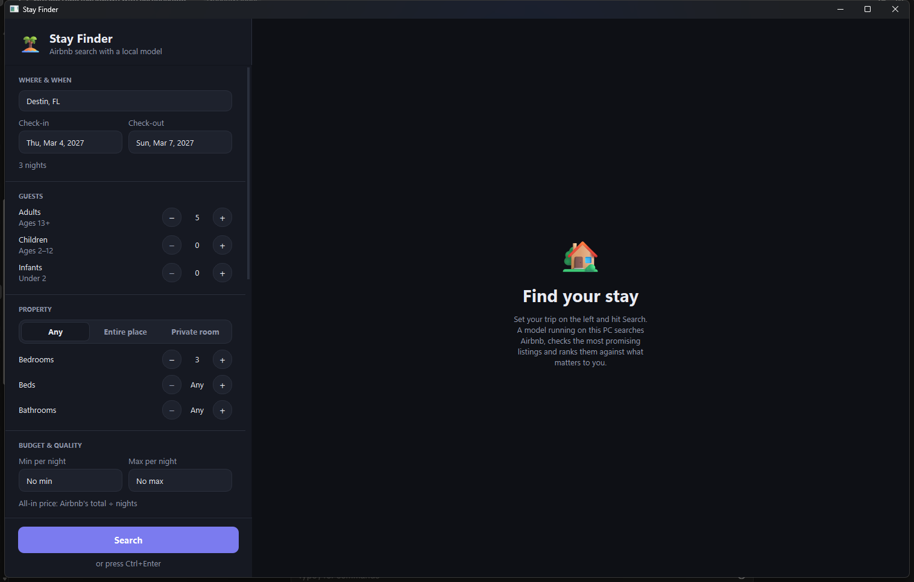
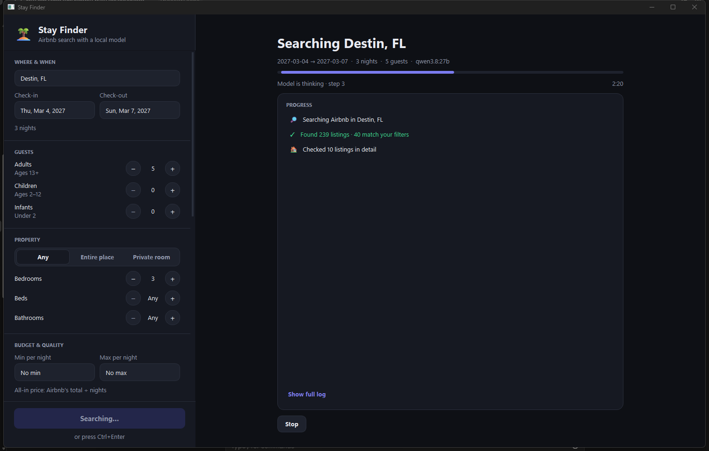
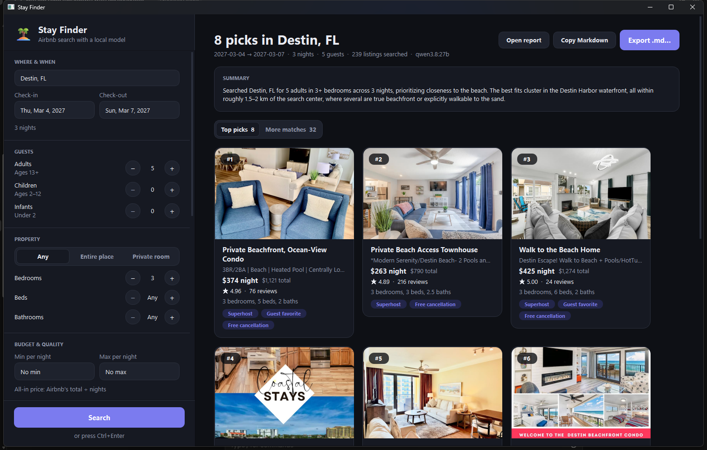
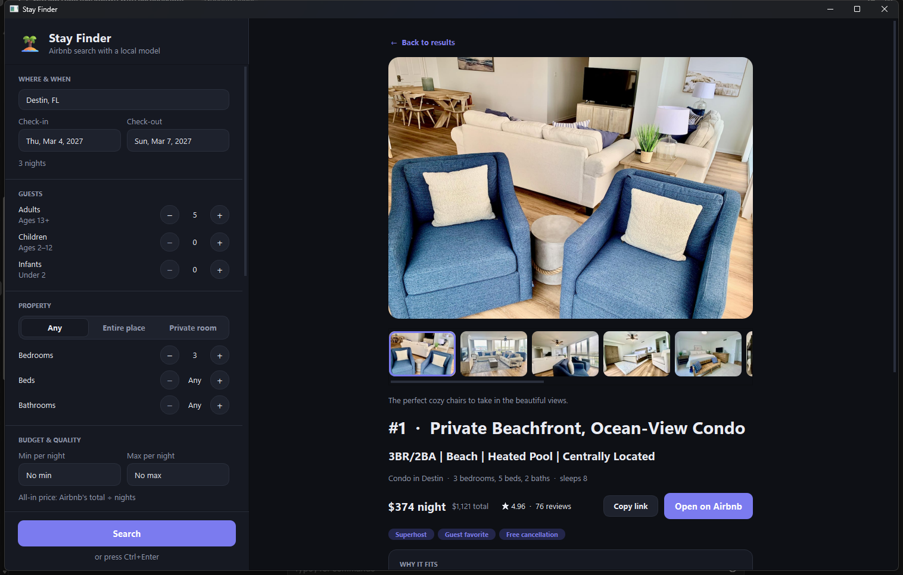

# Stay Finder 🏝

A desktop app that searches Airbnb for you and uses a **local LLM** (via [Ollama](https://ollama.com)) to
shortlist and rank the listings against your own free-text preferences — "walkable to the beach," "great
kitchen for cooking," "quiet street," whatever matters to you.

No cloud API calls, no accounts, no API keys. The model runs on your own machine and only talks to Airbnb's
public site and OpenStreetMap for geocoding.



## How it works

1. You set your trip (location, dates, guests) and filters (budget, bedrooms, amenities, ratings, ...) in the
   sidebar, plus a free-text box for what matters most to you.
2. A local Ollama model acts as an agent: it decides how to search, calls Airbnb through tool functions, checks
   the most promising listings in detail, and ranks them against your stated preferences.
3. **Every fact in the results — names, prices, links, photos — comes straight from Airbnb's data, not the
   model.** The model only searches, verifies, and ranks; it never invents details.
4. Progress streams into the UI while it works, with a running log and a Stop button.



5. Results show as a grid of photo cards — top picks and "more matches" that passed your filters but didn't make
   the cut. Click a card for the full detail page: photo gallery, pros/cons, notable amenities, and a link
   straight to the listing on Airbnb.




6. A Markdown report is written to the `reports/` folder for every search — ranked picks with photos and
   links, ready to copy into a trip-planning doc or turn into a slide deck. Export it, copy it, or open it
   straight from the app.

## Requirements

- Windows (uses `PySide6`, `os.startfile`, and Windows light/dark theme detection)
- Python 3.11+
- [Ollama](https://ollama.com) installed and running locally (see below)
- At least one tool-capable local model pulled through Ollama

### Minimum hardware

Everything runs on your own machine — no cloud, no GPU rental — but the model needs somewhere to live:

| | Minimum | Recommended |
|---|---|---|
| RAM | 16 GB | 32 GB+ |
| GPU | Not required (CPU works, just slower) | 8 GB+ VRAM for smooth, fast responses |
| Disk | ~5 GB free for a small model | 15–20 GB+ if you want a larger, sharper-ranking model |

Smaller models (e.g. `qwen3:8b`, ~5 GB) run fine on a modest laptop with no dedicated GPU, just slower per
step. Larger models (e.g. `qwen3.8:27b`, ~18 GB, or `gpt-oss:20b`, ~13 GB) rank and write noticeably better but
want a GPU with enough VRAM to hold them — otherwise Ollama spills to CPU/RAM and each step gets much slower.

### 1. Install Ollama

Download and install Ollama for your platform from **[ollama.com/download](https://ollama.com/download)**,
then launch it (it runs quietly in the background/tray and exposes a local API — you don't need to interact
with it directly).

### 2. Pull a model

Any model that supports **tool calling** works. From a terminal:

```bash
ollama pull qwen3:8b
```

That's a good default for most machines. If you have a beefier GPU and want better results, try:

```bash
ollama pull gpt-oss:20b
```

You can pull more than one and switch between them from the **Model** dropdown in the app's sidebar — Stay
Finder automatically lists every tool-capable model you've pulled.

### 3. Install Python dependencies

```bash
pip install -r requirements.txt
```

## Running it

```bash
python StayFinder.py
```

Set your trip and filters in the sidebar, pick a local model, and hit **Search** (or `Ctrl+Enter`). The app
remembers your last search and follows the Windows light/dark setting.

### Without the UI

Edit the `CRITERIA` at the top of `StayFinderSearch.py` and run it directly:

```bash
python StayFinderSearch.py
```

This is the same search engine the desktop app drives, useful for quick tweaks or scripting.

## Notes

- Airbnb has no public API — `pyairbnb` talks to the same endpoints the website uses, so it can break if
  Airbnb changes things.
- Hard filters (price, rating, capacity, required amenities, etc.) are enforced in Python, not left to the
  model's judgment — the model only weighs the soft, free-text preferences.
